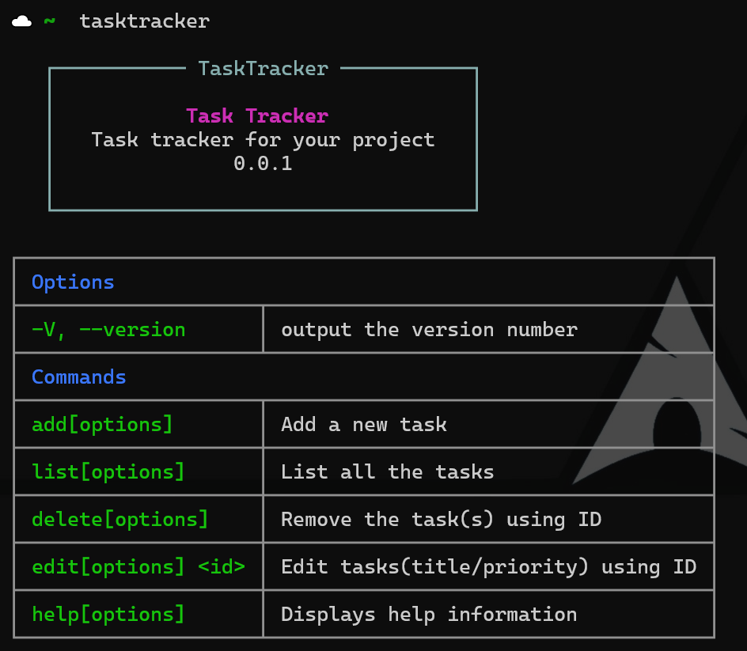

# TaskTracker

A command-line interface (CLI) tool for efficient task prioritization and management.



## Table of contents
- [Introduction](#Introduction)
- [Installation](#Installation)
- [Usage](#Usage)
- [Examples](#Example)
- [Contributing](#Contribute)


# Introduction

TaskTracker is a task prioritization CLI tool that ensures you work on the right tasks at the right time. It helps you organize your project tasks and provides a clear path to tackle them efficiently. With its intuitive command-line interface, you can quickly prioritize and manage your project workload.


# Installation

```
    npm install tasktracker
```

# Usage
## Add Command

Add command can be used to add a new task in the ToDo list.
```
 npx tasktracker add
```
or 
```
npx tasktracker a
```

You'll have to provide the following details
- Title
> This is the title of the task, it can be edited later on using the task ID.

- priority
> This input is to set the priority of the task, namely three - High, Medium, Low
1. High - This priority flag can be used for the tasks that are important and requires imediate attention.
2. Medium - This priority flag for the tasks that are important but don't require immediate attention.
3. Low - This is used for tasks that can be ignored for the present time being, but needs to be done later on.

## Edit Command

Edit command is used to edit the title or priority of any task by providing its ID.

It can be invoked using this - 
```
    npx tasktracker edit <id>
```
or 
```
npx tasktracker e <id>
```

## Delete 

Delete command is used to delete any specific task or all the tasks

```
npx tasktracker delete
```
or 
```
npx tasktracker d
```

## List

It is used to list all the added tasks along with additional information

```
npx tasktracker list
```
or
```
npx tasktracker l
```

# Example

### Adding a task
```npx tracker a```
? Task title? This is a random task title
? Select the task priority Medium priority
medium
Content appended successfully!:  This is a random task title priority:  medium

### Listing all the tasks
```npx tasktracker l```
┌─────┬──────────────────────────────────────────┬──────────┬─────────────┬─────────────────┐
│ ID  │ Task                                     │ Priority │ Time Added  │ Date Added      │
├─────┼──────────────────────────────────────────┼──────────┼─────────────┼─────────────────┤
│ k7t │ This is a random task to be added        │ medium   │ 12:18:03 PM │ Sat Jun 29 2024 │
├─────┼──────────────────────────────────────────┼──────────┼─────────────┼─────────────────┤
│ N6V │ This is the new title of the second task │ medium   │ 12:19:55 PM │ Sat Jun 29 2024 │
└─────┴──────────────────────────────────────────┴──────────┴─────────────┴─────────────────┘

### Editing a task
```npx tasktracker e N6V```
? What do you want to edit title
? New Title of the task This is the new title of the second task
Task updated

# Contribute
1. Git fork and clone this repo
2. Make a PR

> Saurabhje